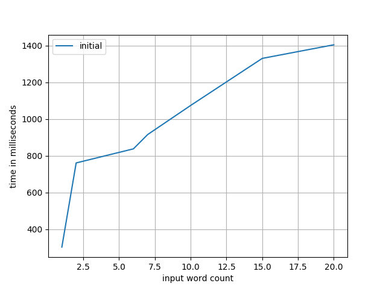

Tensorflow Optimization
=======================

We're starting with the `g2p_en`_ library, with the version released just prior
to their move from Tensorflow to NumPy (commit: 7caf9d69). Not encoded in this
initial commit are the following changes:

- some refactors for running in Python 3.x: relative imports, inheritence, etc
- removal of all training-specific code; we're only looking to optimize
  inference here
- CPU-only configuration; since I'm curious to see what the maximum performance
  we can get without a GPU

Usage
-----

.. code-block:: console

    $ docker build -t tfopt .
    $ docker run --rm -it tfopt python
    >>> import g2p
    >>> g2p.predict('aardvark')
    [['AA1', 'R', 'D', 'V', 'AA2', 'R', 'K']]

Profiling
---------

.. code-block:: console

    $ docker build -t tfopt .
    $ docker run --rm -it \
          --cpus=1 --memory=4G \
          -v $(pwd)/results:/results \
          tfopt python /src/profile.py

Optimizations
-------------

First off, let's get our initial values benchmarked.

.. _g2p_en: https://github.com/Kyubyong/g2p/tree/7caf9d695b178c83f9c3d3e16c3f0a4f4d4d03a2
