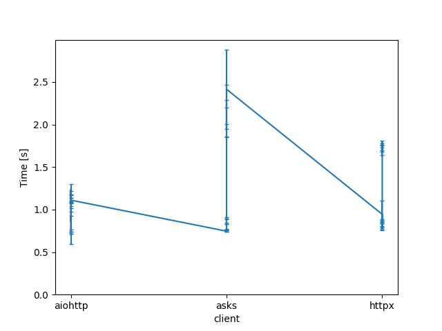

Asyncio HTTP Client Perf
========================

A quick comparison of popular async client libraries for performing HTTP
requests in Python.

Usage
-----

Start the server::

    $ make server

Then, in a new shell::

    $ make bench

Results
-------

+------------------------------------------+----------------+-------------+-------------+-------------+
| Command                                  | Mean [ms]      | Min [ms]    | Max [ms]    | Relative    |
+==========================================+================+=============+=============+=============+
| ``aiohttp run --count=1 --batch=1``      | 724.3 ± 12.2   | 709.2       | 749.1       | 1.00        |
+------------------------------------------+----------------+-------------+-------------+-------------+
| ``aiohttp run --count=10 --batch=1``     | 727.7 ± 8.5    | 720.3       | 748.1       | 1.00 ± 0.02 |
+------------------------------------------+----------------+-------------+-------------+-------------+
| ``aiohttp run --count=10 --batch=10``    | 907.6 ± 313.8  | 715.9       | 1741.1      | 1.25 ± 0.43 |
+------------------------------------------+----------------+-------------+-------------+-------------+
| ``aiohttp run --count=100 --batch=1``    | 869.3 ± 103.2  | 761.5       | 985.9       | 1.20 ± 0.14 |
+------------------------------------------+----------------+-------------+-------------+-------------+
| ``aiohttp run --count=100 --batch=10``   | 984.5 ± 56.2   | 909.3       | 1082.3      | 1.36 ± 0.08 |
+------------------------------------------+----------------+-------------+-------------+-------------+
| ``aiohttp run --count=100 --batch=100``  | 1095.4 ± 80.3  | 893.1       | 1166.9      | 1.51 ± 0.11 |
+------------------------------------------+----------------+-------------+-------------+-------------+
| ``aiohttp run --count=1000 --batch=1``   | 1235.8 ± 64.6  | 1176.8      | 1365.1      | 1.71 ± 0.09 |
+------------------------------------------+----------------+-------------+-------------+-------------+
| ``aiohttp run --count=1000 --batch=10``  | 1087.3 ± 11.4  | 1071.7      | 1108.0      | 1.50 ± 0.03 |
+------------------------------------------+----------------+-------------+-------------+-------------+
| ``aiohttp run --count=1000 --batch=100`` | 1107.1 ± 28.3  | 1090.2      | 1185.5      | 1.53 ± 0.05 |
+------------------------------------------+----------------+-------------+-------------+-------------+
| ``aiohttp run --count=1000 --batch=100`` | 1110.7 ± 23.0  | 1094.7      | 1173.0      | 1.53 ± 0.04 |
+------------------------------------------+----------------+-------------+-------------+-------------+
| ``asks run --count=1 --batch=1``         | 746.0 ± 7.8    | 737.5       | 759.8       | 1.03 ± 0.02 |
+------------------------------------------+----------------+-------------+-------------+-------------+
| ``asks run --count=10 --batch=1``        | 762.5 ± 8.9    | 752.5       | 776.1       | 1.05 ± 0.02 |
+------------------------------------------+----------------+-------------+-------------+-------------+
| ``asks run --count=10 --batch=10``       | 754.9 ± 11.5   | 744.7       | 782.1       | 1.04 ± 0.02 |
+------------------------------------------+----------------+-------------+-------------+-------------+
| ``asks run --count=100 --batch=1``       | 889.1 ± 6.5    | 882.2       | 902.4       | 1.23 ± 0.02 |
+------------------------------------------+----------------+-------------+-------------+-------------+
| ``asks run --count=100 --batch=10``      | 868.1 ± 37.8   | 840.8       | 930.0       | 1.20 ± 0.06 |
+------------------------------------------+----------------+-------------+-------------+-------------+
| ``asks run --count=100 --batch=100``     | 837.6 ± 8.9    | 829.9       | 859.4       | 1.16 ± 0.02 |
+------------------------------------------+----------------+-------------+-------------+-------------+
| ``asks run --count=1000 --batch=1``      | 2243.2 ± 47.5  | 2185.0      | 2329.5      | 3.10 ± 0.08 |
+------------------------------------------+----------------+-------------+-------------+-------------+
| ``asks run --count=1000 --batch=10``     | 1932.4 ± 70.9  | 1838.7      | 2057.2      | 2.67 ± 0.11 |
+------------------------------------------+----------------+-------------+-------------+-------------+
| ``asks run --count=1000 --batch=100``    | 2156.5 ± 309.5 | 1833.5      | 2946.7      | 2.98 ± 0.43 |
+------------------------------------------+----------------+-------------+-------------+-------------+
| ``asks run --count=1000 --batch=100``    | 2415.0 ± 467.8 | 1798.4      | 3058.4      | 3.33 ± 0.65 |
+------------------------------------------+----------------+-------------+-------------+-------------+
| ``httpx run --count=1 --batch=1``        | 944.2 ± 161.0  | 791.7       | 1262.8      | 1.30 ± 0.22 |
+------------------------------------------+----------------+-------------+-------------+-------------+
| ``httpx run --count=10 --batch=1``       | 780.9 ± 20.1   | 758.4       | 822.1       | 1.08 ± 0.03 |
+------------------------------------------+----------------+-------------+-------------+-------------+
| ``httpx run --count=10 --batch=10``      | 778.4 ± 19.8   | 763.0       | 827.1       | 1.07 ± 0.03 |
+------------------------------------------+----------------+-------------+-------------+-------------+
| ``httpx run --count=100 --batch=1``      | 856.5 ± 6.6    | 848.7       | 871.5       | 1.18 ± 0.02 |
+------------------------------------------+----------------+-------------+-------------+-------------+
| ``httpx run --count=100 --batch=10``     | 856.8 ± 20.3   | 841.4       | 902.5       | 1.18 ± 0.03 |
+------------------------------------------+----------------+-------------+-------------+-------------+
| ``httpx run --count=100 --batch=100``    | 863.4 ± 25.5   | 842.4       | 910.7       | 1.19 ± 0.04 |
+------------------------------------------+----------------+-------------+-------------+-------------+
| ``httpx run --count=1000 --batch=1``     | 1794.2 ± 15.4  | 1772.2      | 1815.2      | 2.48 ± 0.05 |
+------------------------------------------+----------------+-------------+-------------+-------------+
| ``httpx run --count=1000 --batch=10``    | 1685.3 ± 46.3  | 1627.6      | 1781.8      | 2.33 ± 0.08 |
+------------------------------------------+----------------+-------------+-------------+-------------+
| ``httpx run --count=1000 --batch=100``   | 1723.1 ± 39.6  | 1689.8      | 1808.2      | 2.38 ± 0.07 |
+------------------------------------------+----------------+-------------+-------------+-------------+
| ``httpx run --count=1000 --batch=100``   | 1725.2 ± 29.4  | 1692.1      | 1787.2      | 2.38 ± 0.06 |
+------------------------------------------+----------------+-------------+-------------+-------------+

