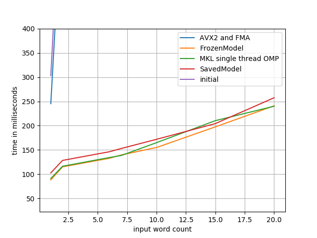
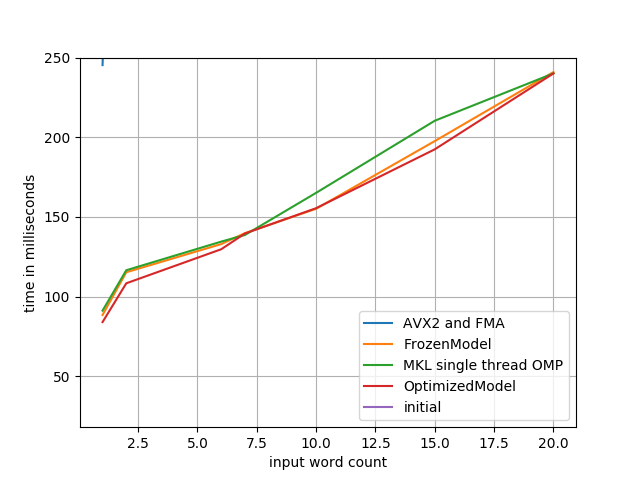
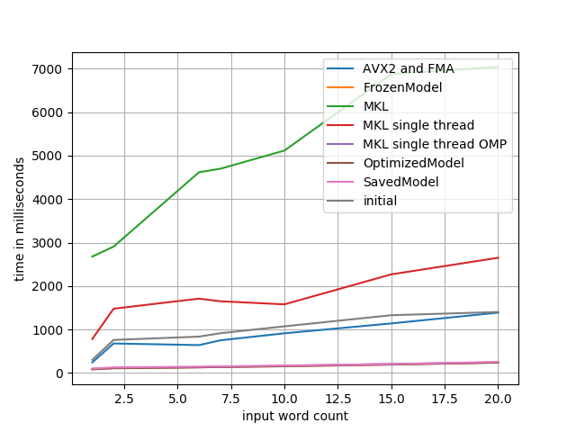

Tensorflow Optimization
=======================

    Note: this experiment has been cleaned up and `posted on my blog <https://thekev.in/blog/2019-06-08-tensorflow-model-optimization/>`_.

This represents an experiment in eking out the absolute most performance from a
Tensorflow model as I possibly can get without modifying the model itself or
running on more than a single CPU.

We're starting with the `g2p_en`_ library, with the version released just prior
to their move from Tensorflow to NumPy (commit: 7caf9d69). Not encoded in this
initial commit are the following changes:

- some refactors for running in Python 3.x: relative imports, inheritence, etc
- removal of all training-specific code; we're only looking to optimize
  inference here
- CPU-only configuration; since I'm curious to see what the maximum performance
  we can get without a GPU

Usage
-----

.. code-block:: console

    $ docker build -t tfopt .
    $ docker run --rm -it tfopt python
    >>> import g2p
    >>> g2p.predict('aardvark')
    [['AA1', 'R', 'D', 'V', 'AA2', 'R', 'K']]

Benchmarking
------------

.. code-block:: console

    $ docker build -t tfopt .
    $ docker run --rm -it \
          --cpus=1 --memory=4G \
          -v $(pwd)/results:/results \
          tfopt python /src/benchmark.py

Optimizations
-------------

First off, let's get our initial values benchmarked.

.. image:: results/initial.png

Compile Tensorflow with AVX2 and FMA
^^^^^^^^^^^^^^^^^^^^^^^^^^^^^^^^^^^^

Well, the first one is the easiest: Tensorflow even warns you about this one.

::

    Your CPU supports instructions that this TensorFlow binary was not compiled to use: AVX2 FMA

Let's go ahead and do that; any more advanced instructions that Tensorflow can
make use of are bound to help us out. Compiling with ``-march=native -mavx2
-mfma -O3`` should do the trick!

.. code-block:: console

    $ docker build -t tensorflow:optimized tensorflow/
    $ docker run --rm -d --name tf tensorflow:optimized sleep 60
    $ docker cp tf:/pkg/tensorflow-1.13.1-cp37-cp37m-linux_x86_64.whl tensorflow/

Note that this process takes ages so I've committed a copy of the built wheel
and modified the ``Dockerfile`` to install from that wheel accordingly.

The new instructions sets give us a nice speedup of about 1.2x.

.. image:: results/avx2_and_fma.png

Use Intel MKL Libs
^^^^^^^^^^^^^^^^^^

The Intel MKL libraries are, in their own words "the fastest and most-used
math libraries for Intel-based systems". That's bold words! Let's take a look.
Using the instructions found `here <https://software.intel.com/en-us/articles/installing-intel-free-libs-and-python-apt-repo>`_, we can install the latest
MKL libs into our test image:

.. code-block:: console

    $ wget https://apt.repos.intel.com/intel-gpg-keys/GPG-PUB-KEY-INTEL-SW-PRODUCTS-2019.PUB
    $ apt-key add GPG-PUB-KEY-INTEL-SW-PRODUCTS-2019.PUB

    $ echo deb https://apt.repos.intel.com/mkl all main > /etc/apt/sources.list.d/intel-mkl.list

    $ apt-get update
    $ apt-get install -qy intel-mkl-2019.4-070

Note that this does nothing until we re-compile (again) Tensorflow to use those
libraries (with ``--config=mkl``). Note that at this point the Tensorflow wheel
has gotten too big for git to handle... to `Gemfury`_ we go!

.. image:: results/mkl.png

Fix Intel MKL Libs
^^^^^^^^^^^^^^^^^^

Clearly that didn't quite do what we wanted it to. Maybe its a threading issue?
Tensorflow defaulted to two threads in the first test case, since it attempts
to determine the number of logical cores when ``intra_op_parallelism_threads``
and/or ``inter_op_parallelism_threads`` are zero, but maybe that logic doesn't
work properly under docker.

.. code-block:: python

    config = tf.ConfigProto(..,
                            intra_op_parallelism_threads=1,
                            inter_op_parallelism_threads=1)

.. image:: results/mkl_single_thread.png

That's... better... but not quite there. Looks like at least one of the reasons
MKL seems to be making things slower is due to bad thread logic. How else can
we fix that up?

.. code-block:: console

    $ export OMP_NUM_THREADS=1

.. image:: results/mkl_single_thread_omp.png

There we go! A speedup of ~5.9x, that's fantastic progress.

The last "obvious" thing to check would be the `Tensorflow Performance Guide`_.
A quick glance at that shows that we've mostly already followed the advice: we
are using MKL, we've optimized our MKL threads, we're using a dynamic RNN
rather than fully fused layers or a static RNN.

About the only thing from that guide we haven't done is avoid using the
``feed_dict`` argument to ``tf.Session.run`` -- but that's irrelevant in our
case, since the advantage of moving away from ``feed_dict`` is to perform
CPU-bound operations while your CPU is otherwise busy inferring. Since we're
not using a GPU at all, its time to break out a profiler and investigate for
ourselves.

Profiling
^^^^^^^^^

At this point, it becomes immediately obvious to me that what I've been using
a script called ``profile.py`` to do benchmarking, not profiling. Fixing that
little blip of bad naming makes room to build ourselves a profiling harness.

Personally, I love using ptracing profilers rather than messing around with
annotating your source code. Uber's `Pyflame`_ used to be my go-to here, but it
turns out that the Uber employee who wrote Pyflame no longer works there and
thus all development (and support for Py 3.x) is `stalled`_. Let's try out
`py-spy`_ instead.

.. code-block:: console

    $ docker run --rm -it \
          --cap-add SYS_PTRACE \
          --cpus=1 --memory=4G \
          -v$(pwd)/results:/results \
          tfopt \
          py-spy -d60 -f/results/profile.svg -- python /src/profile.py

That's a whole bunch less useful than I had hoped it would be. Turns out we're
spending the vast majority of our time within Tensorflow on `this line <https://github.com/tensorflow/tensorflow/blob/6612da89516247503f03ef76e974b51a434fb52e/tensorflow/python/client/session.py#L1405>`_,
which... well, I can't exactly say I'm surprised.

Model Saving
^^^^^^^^^^^^

Let's explore out model and see what we can see. My first approach here was to
look into using ``saved_model_cli show --dir /src/g2p/model/ --all``, but it
turns out I got my terminology a bit confused there and we're not actually
using a ``SavedModel`` directly, but rather using ``tf.train.Saver`` to restore
from checkpoints. Maybe we should see about converting that?

.. code-block:: python

    >>> import tensorflow as tf
    >>> from g2p.session import SESSION
    >>>
    >>> tf.saved_model.simple_save(
    ...     SESSION,
    ...     '/g2p',
    ...     inputs={'x': GRAPH.x, 'y': GRAPH.y},
    ...     outputs={'preds': GRAPH.preds})

The above command creates a ``SavedModel`` stored in the ``/g2p`` directory.
For some reason I don't understand, it won't be quite useable as-is -- the
``simple_save`` command doesn't seem to, uh, save all the things you need.
You'll need to manually copy the ``data`` and ``index`` files from our previous
checkpoints into the new ``SavedModel``'s ``variables`` directory.

At this point, we can modify our code to make use of the ``SavedModel``, rather
than the checkpoints:

.. code-block:: python

    tf.saved_model.load(SESSION, ['serve'], MODEL_PATH)

We haven't actually made any changes to the model yet, other than some internal
things about how its loaded, but just to double check...

.. image:: results/savedmodel.png

Yup, no change, that's easily within margin of error.

Model Freezing
^^^^^^^^^^^^^^

Next step is to "freeze" the model, which will prune unnecessary nodes,
de-duplicate repeated variables, and generally make things ``const`` wherever
possible. This in itself has potential to be an optimization:

.. code-block:: python

    >>> import tensorflow as tf
    >>> from g2p.session import SESSION
    >>> output_graph_def = tf.graph_util.convert_variables_to_constants(
    ...     SESSION, SESSION.graph_def, ['preds'])
    >>> with tf.gfile.GFile('frozen_model.pb', 'wb') as f:
    ...     f.write(output_graph_def.SerializeToString())

Note that at this point I found out that ``Graph.preds`` had not previously
been assigned a name and thus could not be exported. TIL: its not the name of
the variable which is used, but the literal ``.name`` attribute attached to
that variable. For example, the following class has a variable named ``bar``,
not one named ``foo``:

.. code-block:: python

    class Graph:
        def __init__(self):
            self.foo = tf.placeholder(tf.int32, shape=(None, 42), name='bar')

Anyway, this step gives us a ``frozen_model.pb`` file. Let's switch to loading
it instead of our ``SavedModel``.

.. code-block:: python

    g = tf.Graph()
    with tf.gfile.GFile(FROZEN_MODEL_PATH, 'rb') as f:
        graph_def = tf.GraphDef()
        graph_def.ParseFromString(f.read())

    with g.as_default():
        tf.import_graph_def(graph_def, name='prefix')

    SESSION = tf.Session(graph=g)

Note that we no longer need to have the ``Graph`` class at all! The only parts
of it which we still need for inference are in the call to ``SESSION.run()``,
but that can be easily solved with a refactor:

.. code-block:: python

    # SESSION.run(GRAPH.preds, {GRAPH.x: x, GRAPH.y: y})
    GRAPHpreds = g.get_tensor_by_name('prefix/preds:0')
    GRAPHx = g.get_tensor_by_name('prefix/grapheme:0')
    GRAPHy = g.get_tensor_by_name('prefix/phoneme:0')
    SESSION.run(GRAPHpreds, {GRAPHx: x, GRAPHy: y})

This brings us to a speedup of 6x -- technically a bit more than we had before,
but nothing to write home about. Hopefully, all the biggest improvements will
come in the next step.

Model Optimization
^^^^^^^^^^^^^^^^^^
So far we've done a whole lot of busy work to convert from checkpointed models
to a frozen model. Now, not to say its been entirely useless: we got to trim
out a bunch of code that's now only necessary for training, we cut our model
size down from 4.8MB to 1.5MB, and we learned the value of friendship in the
process.

But the real point of doing this this migration is so that we can make use of
the `Graph Transform tool`_. Let's apply a bunch of standard optimization
transforms and see if they help. Specifically, we're going to call a bunch of
operations that mostly do exactly what they say they do:

- ``fold_batch_norms`` and ``fold_old_batch_norms``: merge batch normalization
  multiplications with any multiplications from the previous layer. There are
  two implementations of batch normalization in Tensorflow, so we need to
  specify both.
- ``fold_constants``
- ``merge_duplicate_nodes``
- ``remove_nodes(op=Identity)``: strip identity operations (eg. noops) from the
  model. Note that this operation will break your model if you use control flow
  operations (as we do), so I won't be applying it.
- ``remove_nodes(op=CheckNumerics)``: this one isn't always safe to remove; it
  is meant to catch NaNs and Infs getting passed in. In our case, we know our
  inputs must already be non-negative integers (and pretty darn small ones at
  that), so we're good to remove these.
- ``strip_unused_nodes``

These transformations will get applied in the order we specify, so its
important to eg. remove unused nodes before folding constants, since the
removal of unused nodes may make the constant folding catch more cases.

.. code-block:: python

    >>> import tensorflow as tf
    >>> from tensorflow.tools.graph_transforms import TransformGraph
    >>> from g2p.session import graph_def
    >>> optimized_graph_def = TransformGraph(
    ...     graph_def,
    ...     ['grapheme', 'phoneme'],
    ...     ['preds'],
    ...     [
    ...         'strip_unused_nodes',
    ...         'remove_nodes(op=CheckNumerics)',
    ...         'merge_duplicate_nodes',
    ...         'fold_constants',
    ...         'fold_batch_norms',
    ...         'fold_old_batch_norms',
    ...     ])
    >>> tf.train.write_graph(
    ...     optimized_graph_def,
    ...     '/src/g2p/model/saved',
    ...     'optimized_model.pb',
    ...     as_text=False)

With a speedup of 6.19x, we're making (some) progress, though I'll admit I'd
been hoping for more.

There's a few other transformations which could be helpful in optimizing
performance, but do so at the expense of accuracy, which is a whole can of
worms I don't want to open at the point. If you're interested, grep for
"quantize" in the Graph Transformation docs.

Back to Profiling
^^^^^^^^^^^^^^^^^

That about covers all I know about optimizing Tensorflow itself -- what about
the rest of our codebase? Let's do some more profiling -- this time with the
`line_profiler`_ module, since getting a line-by-line look at the
``g2p.predict`` method will hopefully show us something exciting.

.. code-block:: console

    $ docker run --rm -it \
          --cpus=1 --memory=4G \
          tfopt \
          kernprof -lv /src/profile.py
    Wrote profile results to profile.py.lprof
    Timer unit: 1e-06 s

    Total time: 12.6606 s
    File: /src/g2p/predict.py
    Function: predict at line 12

    Line #      Hits         Time  Per Hit   % Time  Line Contents
    ==============================================================
        12                                           @profile
        13                                           def predict(text: str) -> typing.List[str]:
        14        70        808.0     11.5      0.0      words = [w.lower() for w in text.split()]
        15        70        144.0      2.1      0.0      if len(words) > MAX_LEN:
        16                                                   raise Exception(f'can not process >{MAX_LEN} words')
        17
        18        70        545.0      7.8      0.0      x = np.zeros((len(words), MAX_LEN), np.int32)  # 0: <PAD>
        19       680        989.0      1.5      0.0      for i, w in enumerate(words):
        20      3840       5665.0      1.5      0.0          for j, g in enumerate((w + 'E')[:MAX_LEN]):
        21      3230       5859.0      1.8      0.0              x[i][j] = GRAPHEME_TO_INDEX.get(g, 2)  # 2: <UNK>
        22
        23                                               # Auto-regressive inference
        24        70        233.0      3.3      0.0      preds = np.zeros((len(x), MAX_LEN), np.int32)
        25      1470       2674.0      1.8      0.0      for j in range(MAX_LEN):
        26      1400   12597953.0   8998.5     99.5          _preds = SESSION.run(GRAPH.preds, {GRAPH.x: x, GRAPH.y: preds}
    )
        27      1400      15989.0     11.4      0.1          preds[:, j] = _preds[:, j]
        28
        29                                               # convert to string
        30        70        108.0      1.5      0.0      phonemes = []
        31       680       1104.0      1.6      0.0      for pred in preds:
        32       610      25127.0     41.2      0.2          p = [INDEX_TO_PHONEME[idx] for idx in pred]
        33       610       1044.0      1.7      0.0          if '<EOS>' in p:
        34       610       1395.0      2.3      0.0              p = p[:p.index('<EOS>')]
        35
        36       610        901.0      1.5      0.0          phonemes.append(p)
        37
        38        70         82.0      1.2      0.0      return phonemes

Or, you know, maybe not. A bit of low-hanging fruit in the unnecessary
``_preds`` assignment, but overall there's very little to do here, the
Tensorflow operations take such a vast majority of the time spent, that
everything else is completely eclipsed.

Either way, this is a pretty nice place to be. Our final results definitely
show some great progress having been made.

Final Thoughts
^^^^^^^^^^^^^^

So how would we eke out even more power here, if we want to go absolutely
crazy?

- GPU decoding, of course. Not just for the speedup, but also for the batching:
  on a GPU, we'd be able to run multiple inference tasks at once, and do all
  our CPU-bound work in the meantime.
- Model-modifying changes. Things like quanitizing our data down to a smaller
  byte size or playing with alternate model architectures which aren't quite as
  heavy-weight.
- Dump Python. Python's Tensorflow implementation is decent, but switching over
  to, say, C++'s Tensorflow Serving architecture could be a whole bunch faster.
  I'm not 100% sold on the idea of their standard approach of building a
  client/server architecture and interacting via gRPC, but I'm sure the runtime
  is faster.
- Take a look at the Tensorflow internals. There's no way they've implemented
  every possible speedup, there's gotta be improvements which can be made.

.. _g2p_en: https://github.com/Kyubyong/g2p/tree/7caf9d695b178c83f9c3d3e16c3f0a4f4d4d03a2
.. _Gemfury: https://manage.fury.io/dashboard/thekevjames
.. _Graph Transform tool: https://github.com/tensorflow/tensorflow/blob/master/tensorflow/tools/graph_transforms/README.md
.. _line_profiler: https://github.com/rkern/line_profiler
.. _py-spy: https://github.com/benfred/py-spy
.. _Pyflame: https://github.com/uber/pyflame
.. _stalled: https://github.com/uber/pyflame/pull/153#issuecomment-483496650
.. _Tensorflow Performance Guide: https://www.tensorflow.org/guide/performance/overview
