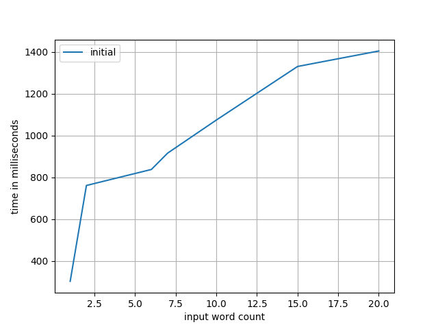
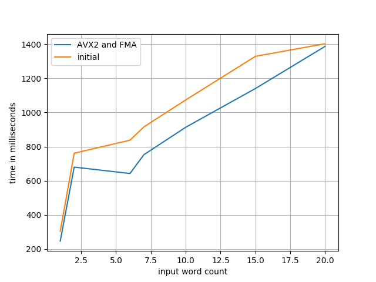
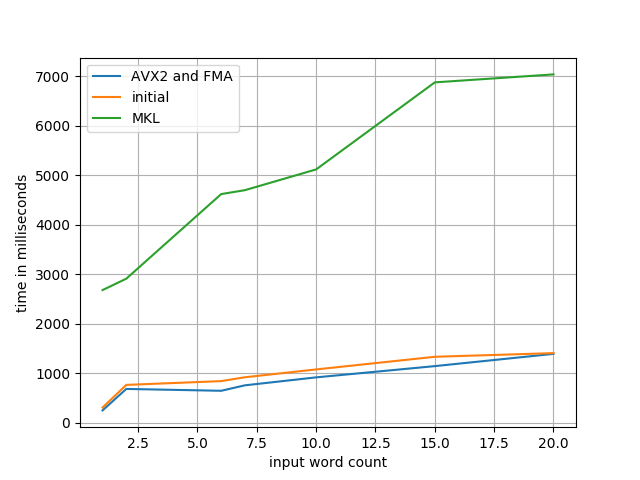
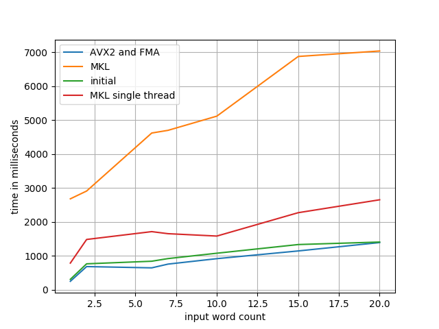
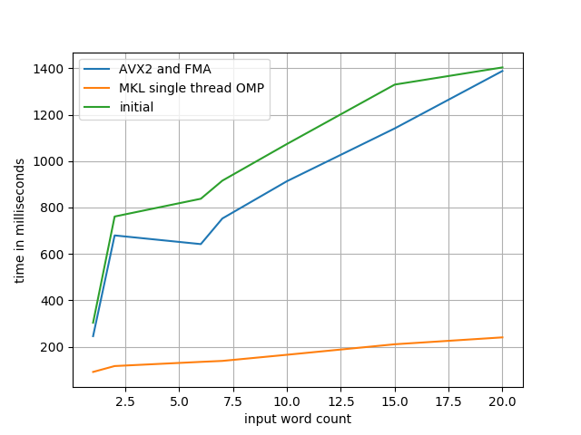

Tensorflow Optimization
=======================

This represents an experiment in eking out the absolute most performance from a
Tensorflow model as I possibly can get without modifying the model itself or
running on more than a single CPU.

We're starting with the `g2p_en`_ library, with the version released just prior
to their move from Tensorflow to NumPy (commit: 7caf9d69). Not encoded in this
initial commit are the following changes:

- some refactors for running in Python 3.x: relative imports, inheritence, etc
- removal of all training-specific code; we're only looking to optimize
  inference here
- CPU-only configuration; since I'm curious to see what the maximum performance
  we can get without a GPU

Usage
-----

.. code-block:: console

    $ docker build -t tfopt .
    $ docker run --rm -it tfopt python
    >>> import g2p
    >>> g2p.predict('aardvark')
    [['AA1', 'R', 'D', 'V', 'AA2', 'R', 'K']]

Profiling
---------

.. code-block:: console

    $ docker build -t tfopt .
    $ docker run --rm -it \
          --cpus=1 --memory=4G \
          -v $(pwd)/results:/results \
          tfopt python /src/profile.py

Optimizations
-------------

First off, let's get our initial values benchmarked.

Compile Tensorflow with AVX2 and FMA
^^^^^^^^^^^^^^^^^^^^^^^^^^^^^^^^^^^^

Well, the first one is the easiest: Tensorflow even warns you about this one.

::

    Your CPU supports instructions that this TensorFlow binary was not compiled to use: AVX2 FMA

Let's go ahead and do that; any more advanced instructions that Tensorflow can
make use of are bound to help us out. Compiling with ``-march=native -mavx2
-mfma -O3`` should do the trick!

.. code-block:: console

    $ docker build -t tensorflow:optimized tensorflow/
    $ docker run --rm -d --name tf tensorflow:optimized sleep 60
    $ docker cp tf:/pkg/tensorflow-1.13.1-cp37-cp37m-linux_x86_64.whl tensorflow/

Note that this process takes ages so I've committed a copy of the built wheel
and modified the ``Dockerfile`` to install from that wheel accordingly.

The new instructions sets give us a nice speedup of about 1.2x.

Use Intel MKL Libs
^^^^^^^^^^^^^^^^^^

The Intel MKL libraries are, in their own words "the fastest and most-used
math libraries for Intel-based systems". That's bold words! Let's take a look.
Using the instructions found `here <https://software.intel.com/en-us/articles/installing-intel-free-libs-and-python-apt-repo>`_, we can install the latest
MKL libs into our test image:

.. code-block:: console

    $ wget https://apt.repos.intel.com/intel-gpg-keys/GPG-PUB-KEY-INTEL-SW-PRODUCTS-2019.PUB
    $ apt-key add GPG-PUB-KEY-INTEL-SW-PRODUCTS-2019.PUB

    $ echo deb https://apt.repos.intel.com/mkl all main > /etc/apt/sources.list.d/intel-mkl.list

    $ apt-get update
    $ apt-get install -qy intel-mkl-2019.4-070

Note that this does nothing until we re-compile (again) Tensorflow to use those
libraries (with ``--config=mkl``). Note that at this point the Tensorflow wheel
has gotten too big for git to handle... to `Gemfury`_ we go!

Fix Intel MKL Libs
^^^^^^^^^^^^^^^^^^

Clearly that didn't quite do what we wanted it to. Maybe its a threading issue?
Tensorflow defaulted to two threads in the first test case, since it attempts
to determine the number of logical cores when ``intra_op_parallelism_threads``
and/or ``inter_op_parallelism_threads`` are zero, but maybe that logic doesn't
work properly under docker.

.. code-block:: python

    config = tf.ConfigProto(..,
                            intra_op_parallelism_threads=1,
                            inter_op_parallelism_threads=1)

That's... better... but not quite there. Looks like at least one of the reasons
MKL seems to be making things slower is due to bad thread logic. How else can
we fix that up?

.. code-block:: console

    export OMP_NUM_THREADS=1

There we go! A speedup of ~5.9x, that's fantastic progress.

.. _g2p_en: https://github.com/Kyubyong/g2p/tree/7caf9d695b178c83f9c3d3e16c3f0a4f4d4d03a2
.. _Gemfury: https://manage.fury.io/dashboard/thekevjames
