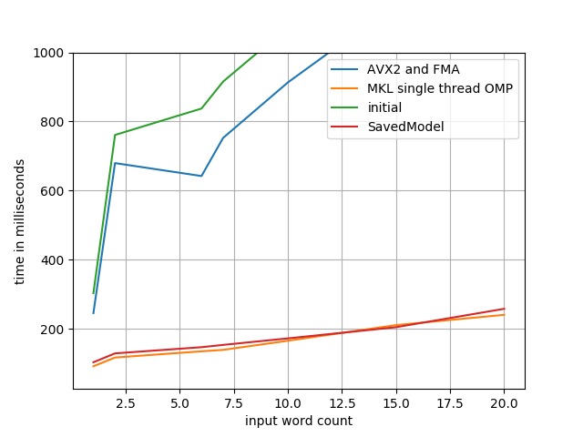

Tensorflow Optimization
=======================

This represents an experiment in eking out the absolute most performance from a
Tensorflow model as I possibly can get without modifying the model itself or
running on more than a single CPU.

We're starting with the `g2p_en`_ library, with the version released just prior
to their move from Tensorflow to NumPy (commit: 7caf9d69). Not encoded in this
initial commit are the following changes:

- some refactors for running in Python 3.x: relative imports, inheritence, etc
- removal of all training-specific code; we're only looking to optimize
  inference here
- CPU-only configuration; since I'm curious to see what the maximum performance
  we can get without a GPU

Usage
-----

.. code-block:: console

    $ docker build -t tfopt .
    $ docker run --rm -it tfopt python
    >>> import g2p
    >>> g2p.predict('aardvark')
    [['AA1', 'R', 'D', 'V', 'AA2', 'R', 'K']]

Benchmarking
------------

.. code-block:: console

    $ docker build -t tfopt .
    $ docker run --rm -it \
          --cpus=1 --memory=4G \
          -v $(pwd)/results:/results \
          tfopt python /src/benchmark.py

Optimizations
-------------

First off, let's get our initial values benchmarked.

.. image:: results/initial.png

Compile Tensorflow with AVX2 and FMA
^^^^^^^^^^^^^^^^^^^^^^^^^^^^^^^^^^^^

Well, the first one is the easiest: Tensorflow even warns you about this one.

::

    Your CPU supports instructions that this TensorFlow binary was not compiled to use: AVX2 FMA

Let's go ahead and do that; any more advanced instructions that Tensorflow can
make use of are bound to help us out. Compiling with ``-march=native -mavx2
-mfma -O3`` should do the trick!

.. code-block:: console

    $ docker build -t tensorflow:optimized tensorflow/
    $ docker run --rm -d --name tf tensorflow:optimized sleep 60
    $ docker cp tf:/pkg/tensorflow-1.13.1-cp37-cp37m-linux_x86_64.whl tensorflow/

Note that this process takes ages so I've committed a copy of the built wheel
and modified the ``Dockerfile`` to install from that wheel accordingly.

The new instructions sets give us a nice speedup of about 1.2x.

Use Intel MKL Libs
^^^^^^^^^^^^^^^^^^

The Intel MKL libraries are, in their own words "the fastest and most-used
math libraries for Intel-based systems". That's bold words! Let's take a look.
Using the instructions found `here <https://software.intel.com/en-us/articles/installing-intel-free-libs-and-python-apt-repo>`_, we can install the latest
MKL libs into our test image:

.. code-block:: console

    $ wget https://apt.repos.intel.com/intel-gpg-keys/GPG-PUB-KEY-INTEL-SW-PRODUCTS-2019.PUB
    $ apt-key add GPG-PUB-KEY-INTEL-SW-PRODUCTS-2019.PUB

    $ echo deb https://apt.repos.intel.com/mkl all main > /etc/apt/sources.list.d/intel-mkl.list

    $ apt-get update
    $ apt-get install -qy intel-mkl-2019.4-070

Note that this does nothing until we re-compile (again) Tensorflow to use those
libraries (with ``--config=mkl``). Note that at this point the Tensorflow wheel
has gotten too big for git to handle... to `Gemfury`_ we go!

.. image:: results/mkl.png

Fix Intel MKL Libs
^^^^^^^^^^^^^^^^^^

Clearly that didn't quite do what we wanted it to. Maybe its a threading issue?
Tensorflow defaulted to two threads in the first test case, since it attempts
to determine the number of logical cores when ``intra_op_parallelism_threads``
and/or ``inter_op_parallelism_threads`` are zero, but maybe that logic doesn't
work properly under docker.

.. code-block:: python

    config = tf.ConfigProto(..,
                            intra_op_parallelism_threads=1,
                            inter_op_parallelism_threads=1)

That's... better... but not quite there. Looks like at least one of the reasons
MKL seems to be making things slower is due to bad thread logic. How else can
we fix that up?

.. code-block:: console

    $ export OMP_NUM_THREADS=1

There we go! A speedup of ~5.9x, that's fantastic progress.

The last "obvious" thing to check would be the `Tensorflow Performance Guide`_.
A quick glance at that shows that we've mostly already followed the advice: we
are using MKL, we've optimized our MKL threads, we're using a dynamic RNN
rather than fully fused layers or a static RNN.

About the only thing from that guide we haven't done is avoid using the
``feed_dict`` argument to ``tf.Session.run`` -- but that's irrelevant in our
case, since the advantage of moving away from ``feed_dict`` is to perform
CPU-bound operations while your CPU is otherwise busy inferring. Since we're
not using a GPU at all, its time to break out a profiler and investigate for
ourselves.

Profiling
~~~~~~~~~

At this point, it becomes immediately obvious to me that what I've been using
a script called ``profile.py`` to do benchmarking, not profiling. Fixing that
little blip of bad naming makes room to build ourselves a profiling harness.

Personally, I love using ptracing profilers rather than messing around with
annotating your source code. Uber's `Pyflame`_ used to be my go-to here, but it
turns out that the Uber employee who wrote Pyflame no longer works there and
thus all development (and support for Py 3.x) is `stalled`_. Let's try out
`py-spy`_ instead.

.. code-block:: console

    $ docker run --rm -it \
          --cap-add SYS_PTRACE \
          --cpus=1 --memory=4G \
          -v$(pwd)/results:/results \
          tfopt \
          py-spy -d60 -f/results/profile.svg -- python /src/profile.py

That's a whole bunch less useful than I had hoped it would be. Turns out we're
spending the vast majority of our time within Tensorflow on `this line <https://github.com/tensorflow/tensorflow/blob/6612da89516247503f03ef76e974b51a434fb52e/tensorflow/python/client/session.py#L1405>`_,
which... well, I can't exactly say I'm surprised.

Let's explore out model and see what we can see. My first approach here was to
look into using ``saved_model_cli show --dir /src/g2p/model/ --all``, but it
turns out I got my terminology a bit confused there and we're not actually
using a ``SavedModel`` directly, but rather using ``tf.train.Saver`` to restore
from checkpoints. Maybe we should see about converting that?

.. code-block:: python

    >>> import tensorflow as tf
    >>> from g2p.session import SESSION
    >>>
    >>> tf.saved_model.simple_save(
    ...     SESSION,
    ...     '/g2p',
    ...     inputs={'x': GRAPH.x, 'y': GRAPH.y},
    ...     outputs={'preds': GRAPH.preds})

The above command creates a ``SavedModel`` stored in the ``/g2p`` directory.
For some reason I don't understand, it won't be quite useable as-is -- the
``simple_save`` command doesn't seem to, uh, save all the things you need.
You'll need to manually copy the ``data`` and ``index`` files from our previous
checkpoints into the new ``SavedModel``'s ``variables`` directory.

At this point, we can modify our code to make use of the ``SavedModel``, rather
than the checkpoints:

.. code-block:: python

    tf.saved_model.load(SESSION, ['serve'], MODEL_PATH)

We haven't actually made any changes to the model yet, other than some internal
things about how its loaded, but just to double check...

Yup, no change, that's easily within margin of error.

.. _g2p_en: https://github.com/Kyubyong/g2p/tree/7caf9d695b178c83f9c3d3e16c3f0a4f4d4d03a2
.. _Gemfury: https://manage.fury.io/dashboard/thekevjames
.. _py-spy: https://github.com/benfred/py-spy
.. _Pyflame: https://github.com/uber/pyflame
.. _stalled: https://github.com/uber/pyflame/pull/153#issuecomment-483496650
.. _Tensorflow Performance Guide: https://www.tensorflow.org/guide/performance/overview
